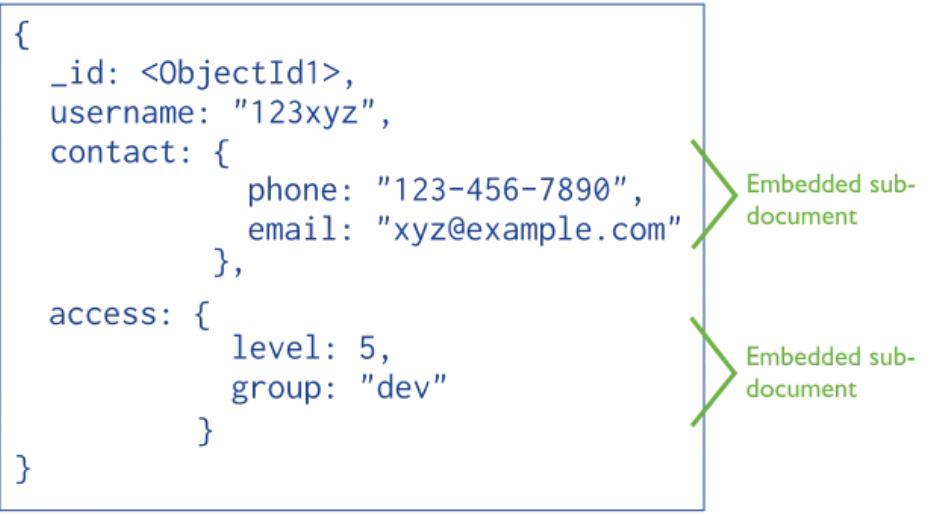
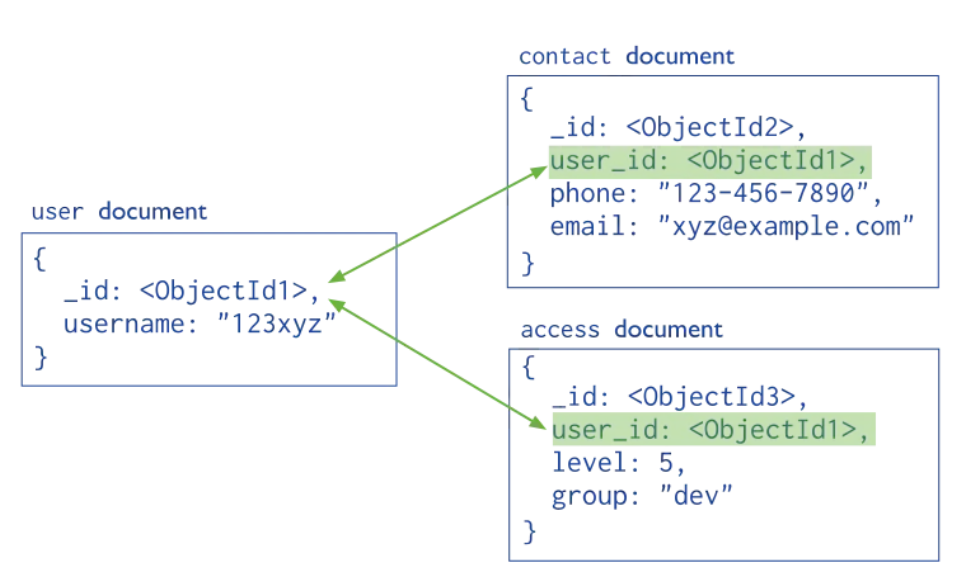
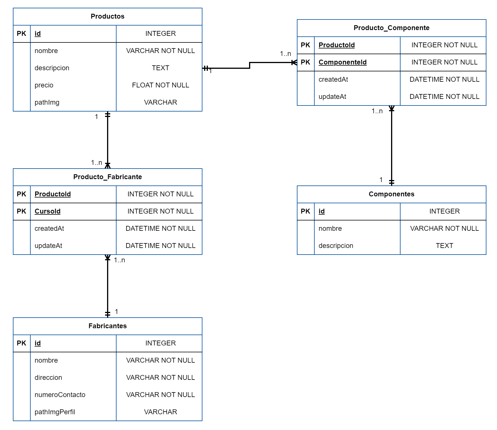

[](https://classroom.github.com/a/QBnwEJ5z)
# Estrategias de Persistencia - TP 2024 - Documental

<details>
  <summary>Descripción del TP</summary>

### Descripción del Trabajo Práctico
Este trabajo práctico tiene como objetivo principal que los alumnos adquieran experiencia práctica en la implementación de las relaciones entre documentos en contexto de una API REST utilizando un ODM (Object-document mapping).

Uno de los criterios que se tiende a confundir es el término de bases de datos NoSQL con la ausencia de relaciones, pero la verdad es que muchas de las bases de datos NoSQL ya nos ofrecen funcionalidades que nos permiten tener cierto grado de relación entre los datos.

## Enfoques de relaciones en MongoDB

Las relaciones en MongoDB se pueden modelar en 2 enfoques diferentes: la relación incrustada o relación referenciada. La elección de estos enfoques dependerá del tipo de casuística a abordar y decisiones de modelamiento de datos.
> **Nota:** La elección está explicada en la descripción del proyecto.

## Relación incrustada

Relación que implica almacenar documentos secundarios incrustados dentro de un documento principal.



## Relaciones referenciadas

Práctica de almacenar manualmente el campo \_id de un documento relacionado como referencia en otro documento. Esto implica que el desarrollador es responsable de mantener la coherencia de las referencias y realizar las consultas necesarias para obtener los detalles completos de los documentos relacionados.



- API REST:
  Una API REST (Representational State Transfer) es un conjunto de reglas y convenciones para la creación de servicios web que permiten la comunicación entre sistemas. En este trabajo práctico, utilizaremos una API REST para exponer recursos y permitir operaciones CRUD (Create, Read, Update, Delete) sobre estos recursos.

- Enfoque Práctico:
  Los alumnos implementarán las relaciones ustilizando el enfoque que considen conveniente en cada caso en el contexto de una API REST utilizando un ODM específico, Mongoose. Se espera que los alumnos comprendan cómo definir modelos, establecer relaciones entre ellos y utilizar las capacidades del ODM para interactuar con la base de datos documental.

- Criterios de Evaluación:
  Se evaluará la precisión y completitud en la implementación de las asociaciones en la API REST, así como la funcionalidad completa del CRUD para los recursos expuestos por la API.

</details>
<details>
  <summary>Descripción del Proyecto</summary>
 
## Descripción del Proyecto

Se ha desarrollado un sistema interno de gestión de productos para una empresa de manufactura. La empresa fabrica una amplia gama de productos tecnológicos que requieren componentes específicos y son producidos por múltiples fabricantes asociados.

La problemática de la empresa por la que se decidió hacer este sistema es que el proceso de gestión de la información es manual y está descentralizado, lo que genera demoras y problemas en la producción.

Se decidió automatizar y centralizar estos datos mediante un sistema web eficiente que permita gestionar los productos, fabricantes y componentes de manera integrada.

## Información de la API a implementar

Se decidió implementar una base de datos **documental** utilizando como base el siguiente diagrama de entidad-relación (DER) diseñado para una base de datos relacional.



#### Descripción del modelo DER

- Un **Producto** puede tener muchos fabricantes, y un **Fabricante** puede fabricar muchos productos.
- Un **Producto** puede tener muchos componentes, y un **Componente** puede formar parte de varios productos.

### Enfoque de relaciones en MongoDB implementado
Se eligió utilizar **relaciones referenciadas** debido a su mayor *flexibilidad* en escenarios con relaciones complejas entre entidades o en aquellos donde el volumen de datos asociados puede crecer significativamente.

En este caso, al usar **relaciones referenciadas**, solo es necesario actualizar el componente, fabricante o producto correspondiente, ya que la relación con el ítem asociado se ajustará automáticamente.

### Base de datos

El sistema utiliza el motor de base de datos **Mongo DB**.

*Se utilizó el archivo docker compose incluido en este proyecto para instanciar el motor de base de datos.*

## Instrucciones necesarias para correr la API.

Instalar las dependencias utilizadas en la API. Para esto hay que utilizar el comando: **npm install**.
Y luego utilizar el comando: **npm start**

*El proyecto cuenta con las dependencias de produccion y desarrollo necesarias de un proyecto node, por ejemplo:*

`npm i mongoose express`

`npm i -D nodemon`


  
## API

Implementar la API utilizando el framework express en el entorde de ejecucion de un poryecto NodeJs. Organizar el código en rutas, controlers y middleware utilizando la separación por recurso. A continuación se detallan los endpoinds que deberán estar disponbiles en la API.

</details>
<details>
  <summary>Endpoints</summary>

### Endpoints
- Todas las peticiones que se realicen a la API deben ser enviadas en **localHost** con el **puerto 3000** que se encuentra por defecto, o modificarlo por variable de entorno.

### Ejemplos de cada recurso de la API con las diferentes respuestas:  


<details>
  <summary> <b>/productos</b></summary>

---

***Descripción:*** Obtiene todos los productos. En caso de que no haya productos devuelve un array vacío.
    
**Respuesta:**
    


```
[
 {
  "descripcion": null,
  "pathImg": null,
  "nombre": "Producto 1",
  "precio": 1500
 },
 {
  "descripcion": null,
  "pathImg": null,
  "nombre": "Producto 2",
  "precio": 3000
 }
]
```
</details>
  

<details>
  <summary> <b>/productos/:id</b></summary>

---

***Descripción:*** Obtiene el producto identificado con el id que se le pase en el recurso. En caso de que ese producto no se encuentre devuelve un mensaje de error.
    
**Respuestas:**
    


```
{
  "descripcion": null,
  "pathImg": null,
  "nombre": "Producto 1",
  "precio": 1500
}
```
---


```
{
  "error": "Producto no encontrado"
}
```
</details>


<details>
  <summary> <b>/productos</b></summary>

---

***Descripción:*** Crea un producto. En caso de pasar mal algún dato lanza un mensaje de error indicando cuál es el error.
    
**Respuestas:**
    


```
{ message: "Producto creado correctamente" }
```
---


```
{
    "errores": [
        {
            "atributo": "precio",
            "error": "El precio del producto debe ser mayor a 0"
        }
    ]
}
```
</details>


<details>
  <summary> <b>/productos/:id</b></summary>

---

***Descripción:*** Modifica los datos del producto identificado con el id que se le pase en el recurso. En caso de que ese producto no se encuentre o se pase mal algún dato, devuelve un mensaje de error indicando cuál es el error.
    
**Respuestas:**
    


```
{
    "message": "Producto actualizado correctamente"
}
```
---


```
{
    "errores": [
        {
            "atributo": "precio",
            "error": "El precio del producto debe ser un número"
        }
    ]
}
```
---


```
{
    "error": "Producto no encontrado"
}
```
</details>


<details>
  <summary> <b>/productos/:id</b></summary>

---

***Descripción:*** Borra el producto identificado con el id que se le pase en el recurso. En caso de que ese producto no se encuentre o no se pueda eliminar, devuelve un mensaje de error.
    
**Respuestas:**
    


```
{ message: "Producto eliminado correctamente" }
```
---


```
{ message: "Producto no encontrado" }
```

--- 


```
{
    "error": "No es posible eliminar el Producto, ya que poseé asociaciones"
}
```
</details>


<details>
  <summary> <b>/productos/:id/fabricantes</b></summary>

---

***Descripción:*** Crea la asociación del producto identificado con el id que se le pase en el recurso con 1 o N fabricantes.
    
**Respuestas:**
    


```
{ message: "Fabricantes asociados al producto" }
```
---


```
{
    "errores": [
        {
            "atributo": "precio",
            "error": "El precio del producto debe ser mayor a 0"
        }
    ]
}
```

--- 


```
{
    "errores": [
        {
            "atributo": 0,
            "error": "\"[0].id\" must be a string"
        }
    ]
}
```
</details>


<details>
  <summary> <b>/productos/:id/fabricantes</b></summary>

---

***Descripción:*** Obtiene todos los fabricantes del producto identificado con el id que se le pase en el recurso.
    
**Respuestas:**
    


```
{
    "descripcion": null,
    "pathImg": null,
    "nombre": "Producto 76",
    "precio": 342,
    "fabricante": [
        {
            "pathImgPerfil": null,
            "nombre": "Fabricante 1",
            "direccion": "Direccion 444",
            "numeroContacto": "011 223-4342"
        }
    ]
}
```
---


```
{
    "error": "Producto no encontrado"
}
```

</details>


<details>
  <summary> <b>/productos/:id/componentes</b></summary>

---

***Descripción:*** Crea la asociación del producto identificado con el id que se le pase en el recurso, con 1 o N componentes.
    
**Respuestas:**
    


```
{
    "message": "Componentes asociados al producto"
}
```
---


```
{
    "error": "Producto no encontrado"
}
```

---


```
{
    "errores": [
        {
            "atributo": 0,
            "error": "\"[0].id\" must be a string"
        }
    ]
}
```
</details>


<details>
  <summary> <b>/productos/:id/componentes</b></summary>

---

***Descripción:*** Obtiene todos los componentes del producto identificado con el id que se le pase en el recurso.
    
**Respuestas:**
    


```
{
    "descripcion": null,
    "pathImg": null,
    "nombre": "Producto 76",
    "precio": 342,
    "componentes": [
        {
        "nombre": "Componente 1",
        "descripcion": "descripcion del componente"
    }
    ]
}
```
---


```
{
    "error": "Producto no encontrado"
}
```

</details>


<details>
  <summary> <b>/fabricantes</b></summary>

---

***Descripción:*** Obtiene todos los fabricantes. En caso de que no haya fabricantes devuelve un array vacío.
    
**Respuesta:**
    


```
[
 {
  "pathImgPerfil": null,
  "nombre": "Fabricante 1",
  "direccion": "Direccion 444",
  "numeroContacto": "011 223-4342"
 },
 {
  "pathImgPerfil": null,
  "nombre": "Fabricante 2",
  "direccion": "Direccion 1345",
  "numeroContacto": "011 9900-8954"
 }
]
```
</details>


<details>
  <summary> <b>/fabricantes/:id</b></summary>

---

***Descripción:*** Obtiene el fabricante identificado con el id que se le pase en el recurso. En caso de que ese fabricante no se encuentre devuelve un mensaje de error.
    
**Respuestas:**
    


```
{
  "pathImgPerfil": null,
  "nombre": "Fabricante 1",
  "direccion": "Direccion 444",
  "numeroContacto": "011 223-4342"
 }
```
---


```
{
  "error": "Fabricante no encontrado"
}
```
</details>


<details>
  <summary> <b>/fabricantes</b></summary>

---

***Descripción:*** Crea un fabricante. En caso de pasar mal algún dato lanza un mensaje de error indicando cuál es el error.
    
**Respuestas:**
    


```
{ message: "Fabricante creado correctamente" }
```
---


```
{
    "errores": [
        {
            "atributo": "nombre",
            "error": "El nombre del fabricante es obligatorio"
        }
    ]
}
```
</details>


<details>
  <summary> <b>/fabricantes/:id</b></summary>

---

***Descripción:*** Modifica los datos del fabricante identificado con el id que se le pase en el recurso. En caso de que ese fabricante no se encuentre o se pase mal algún dato, devuelve un mensaje de error indicando cuál es el error.
    
**Respuestas:**
    


```
{
    "message": "Fabricante actualizado correctamente"
}
```
---


```
{
    "errores": [
        {
            "atributo": "numeroContacto",
            "error": "\"numeroContacto\" must be a string"
        }
    ]
}
```
---


```
{
    "error": "Fabricante no encontrado"
}
```
</details>


<details>
  <summary> <b>/fabricantes/:id</b></summary>

---

***Descripción:*** Borra el fabricante identificado con el id que se le pase en el recurso. En caso de que ese fabricante no se encuentre o no se pueda eliminar, devuelve un mensaje de error.
    
**Respuestas:**
    


```
{ message: "Fabricante eliminado correctamente" }
```
---


```
{ message: "Fabricante no encontrado" }
```

--- 


```
{
    "error": "No es posible eliminar el Fabricante, ya que poseé asociaciones"
}
```
</details>


<details>
  <summary> <b>/fabricantes/:id/productos</b></summary>

---

***Descripción:*** Obtiene todos los productos del fabricante identificado con el id que se le pase en el recurso.
    
**Respuestas:**
    


```
{
    "pathImgPerfil": null,
    "nombre": "Fabricante 1",
    "direccion": "Direccion 444",
    "numeroContacto": "011 223-4342",
    "productos": [
        {
            "descripcion": null,
            "pathImg": null,
            "nombre": "Producto 76",
            "precio": 342
        }
    ]
}
```
---


```
{
    "error": "Fabricante no encontrado"
}
```

</details>
  

<details>
  <summary> <b>/componentes</b></summary>

---

***Descripción:*** Obtiene todos los componentes. En caso de que no haya componentes devuelve un array vacío.
    
**Respuesta:**
    


```
[
 {
  "nombre": "Componente 1",
  "descripcion": "descripcion del componente"
 },
 {
  "nombre": "Componente 2",
  "descripcion": "descripcion del componente 2"
 }
]
```
</details>


<details>
  <summary> <b>/componentes/:id</b></summary>

---

***Descripción:*** Obtiene el componente identificado con el id que se le pase en el recurso. En caso de que ese componente no se encuentre devuelve un mensaje de error.
    
**Respuestas:**
    


```
{
  "nombre": "Componente 1",
  "descripcion": "descripcion del componente"
 }
```
---


```
{
  "error": "Componente no encontrado"
}
```
</details>


<details>
  <summary> <b>/componentes</b></summary>

---

***Descripción:*** Crea un componente. En caso de pasar mal algún dato lanza un mensaje de error indicando cuál es el error.
    
**Respuestas:**
    


```
{ message: "Componente creado correctamente" }
```
---


```
{
    "errores": [
        {
            "atributo": "nombre",
            "error": "El nombre del componente es obligatorio"
        }
    ]
}
```
</details>


<details>
  <summary> <b>/componentes/:id</b></summary>

---

***Descripción:*** Modifica los datos de el componente identificado con el id que se le pase en el recurso. En caso de que ese componente no se encuentre o se pase mal algún dato, devuelve un mensaje de error indicando cuál es el error.
    
**Respuestas:**
    


```
{
    "message": "Componente actualizado correctamente"
}
```
---


```
{
    "errores": [
        {
            "atributo": "nombre",
            "error": "El nombre del componente no puede estar vacío"
        }
    ]
}
```
---


```
{
    "error": "Componente no encontrado"
}
```
</details>


<details>
  <summary> <b>/componentes/:id</b></summary>

---

***Descripción:*** Borra el componente identificado con el id que se le pase en el recurso. En caso de que ese componente no se encuentre o no se pueda eliminar, devuelve un mensaje de error.
    
**Respuestas:**
    


```
{ message: "Componente eliminado correctamente" }
```
---


```
{ message: "Componente no encontrado" }
```

--- 


```
{
    "error": "No es posible eliminar el Componente, ya que poseé asociaciones"
}
```
</details>


<details>
  <summary> <b>/componentes/:id/productos</b></summary>

---

***Descripción:*** Obtiene todos los productos del componente identificado con el id que se le pase en el recurso.
    
**Respuestas:**
    


```
{
    "nombre": "Componente 1",
    "descripcion": "descripcion del componente",
    "productos": [
        {
            "descripcion": null,
            "pathImg": null,
            "nombre": "Producto 76",
            "precio": 342
        }
    ]
}
```
---


```
{
    "error": "Componente no encontrado"
}
```

</details>

</details>
